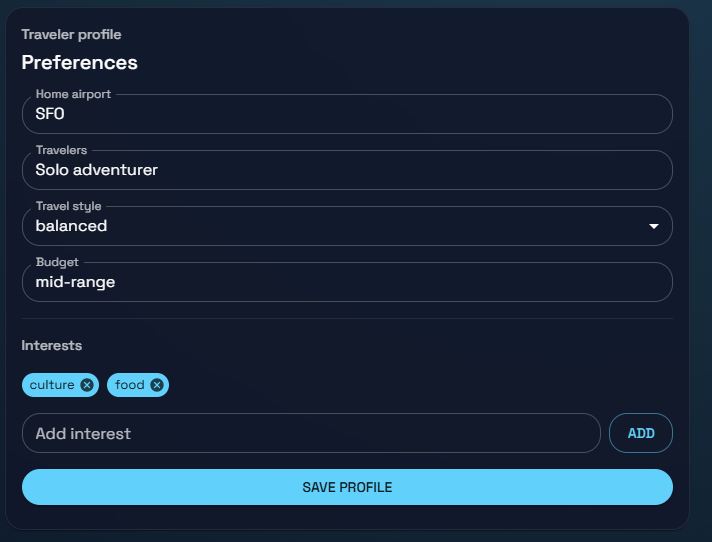
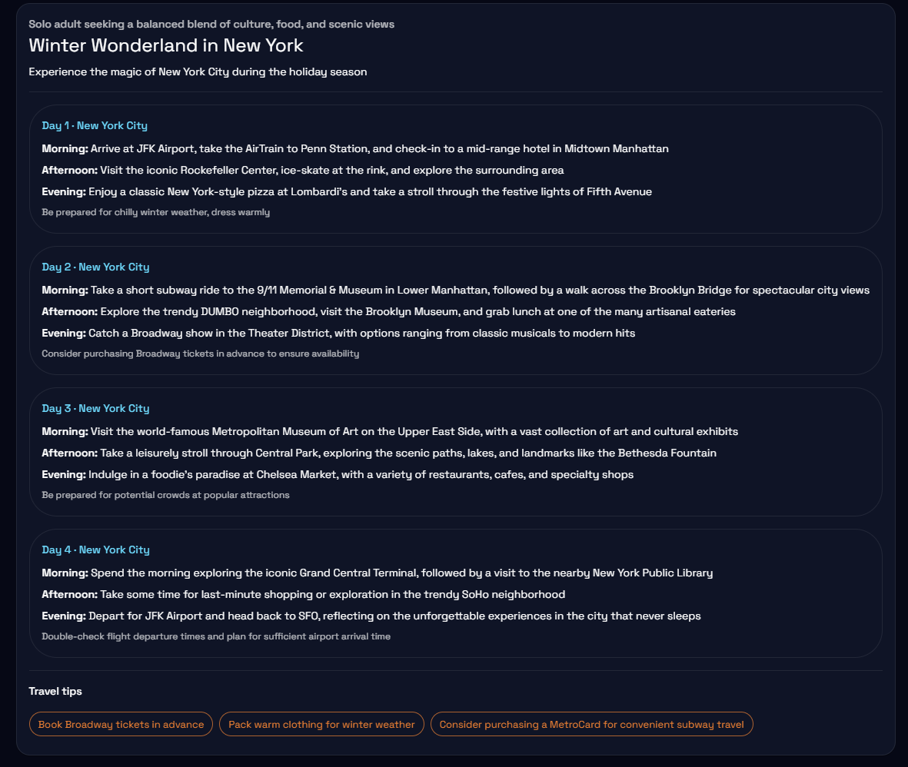

# cf_ai_travel

Cloudflare-backed travel concierge that combines a Workers AI-powered LLM, a workflow/memory layer, and a React chat surface. The project showcases how to gather traveler input, coordinate itinerary generation, and persist state for follow-up conversations.

## Screenshots

### Traveler Profile & Preferences


### AI-Generated Itinerary


## Architecture

- `client/` – React + Vite front end with Material UI. Provides a chat-style interface, profile form, and itinerary visualizations.
- `server/` – Node/Express API that orchestrates a `TripWorkflow`, talks to Cloudflare Workers AI (Llama 3.3), and persists memory/state to a lightweight JSON store.
- `cloudflare/` – Minimal Durable Object/Agents SDK example showing how the workflow can move fully onto Cloudflare Agents with state + AI bindings ([docs](https://developers.cloudflare.com/agents/), [product overview](https://agents.cloudflare.com/)).

## Features

- **LLM integration** – Calls Llama 3.3 via Workers AI or a Cloudflare AI Gateway with graceful mock mode for local development.
- **Workflow coordination** – `TripWorkflow` pipelines context gathering → itinerary planning → persistence, mirroring Cloudflare Workflows semantics.
- **User input** – MUI-based chat UI plus traveler profile form.
- **Memory/state** – Durable JSON store on the server and Durable Object sample in `cloudflare/` to persist preferences and generated plans.

## Prerequisites

- Node.js ≥ 20.16 (Workers AI SDKs recommend ≥20.19; upgrade if you hit engine warnings).
- npm 10+

## Setup

1. **Install dependencies**
   ```bash
   npm install
   npm --prefix server install
   npm --prefix client install
   npm --prefix cloudflare install
   ```

2. **Configure environment**
   
   Create `server/.env` with your Workers AI credentials:
   ```env
   PORT=4000
   CF_ACCOUNT_ID=your_cloudflare_account_id
   CF_API_TOKEN=your_cloudflare_api_token
   CF_AI_GATEWAY_URL=
   CF_AI_MODEL=@cf/meta/llama-3.1-8b-instruct
   MOCK_LLM=false
   ```
   
   Create `client/.env`:
   ```env
   VITE_API_BASE_URL=http://localhost:4000
   ```

3. **Run locally**
   ```bash
   # Start both server and client
   npm run dev
   
   # Or run separately:
   npm run dev:server    # Express API on port 4000
   npm run dev:client    # React app on port 5173
   ```

4. **Build/test**
   ```bash
   npm run lint            # ESLint for the server
   npm run build:client    # Production React build
   ```

## Cloudflare Agent (deployment)

Inside `cloudflare/` you will find a Durable Object-based `TravelAgent` built with the `agents` SDK. To run or deploy:

```bash
cd cloudflare
cp wrangler.toml wrangler.local.toml   # optional override for secrets
npm run dev                            # wrangler dev
npm run deploy                         # deploy to Cloudflare
```

Bind your Workers AI resource (see `[ai]` block in `wrangler.toml`) and add Durable Object migrations per the sample config.

## API surface

- `POST /api/chat` – `{ userId, message, metadata }` → returns `{ plan, workflow, profile }`
- `GET /api/profile/:userId` – fetch stored preferences
- `POST /api/profile` – persist/update traveler profile

## Workflow + memory

- `TripWorkflow` (`server/src/services/workflowService.js`) runs four stages:
  1. `collectContext` merges Durable Object-style profile + prior conversation.
  2. `generatePlan` builds structured prompts (`promptBuilder`) and calls Workers AI.
  3. `persistState` appends conversation logs and stores itineraries.
  4. `buildResponse` emits actionable next steps for the UI.
- `memoryStore` (`server/src/services/memoryStore.js`) is a tiny JSON persistence layer that simulates Durable Object state for local testing.

## Front-end interactions

- `ProfileForm` captures traveler preferences and syncs them via `/api/profile`.
- `ChatPanel` lets users set timing constraints and submit prompts.
- `PlanTimeline` + `ActionChips` visualize LLM output, tips, and workflow actions.

## Cloudflare references

- Cloudflare Agents overview: [agents.cloudflare.com](https://agents.cloudflare.com/)
- Agents SDK docs: [developers.cloudflare.com/agents](https://developers.cloudflare.com/agents/)

## Repository requirements

- Prefixed repo name (`cf_ai_travel`)
- `README.md` (this file) with instructions
- `PROMPTS.md` documenting AI-assisted prompts

